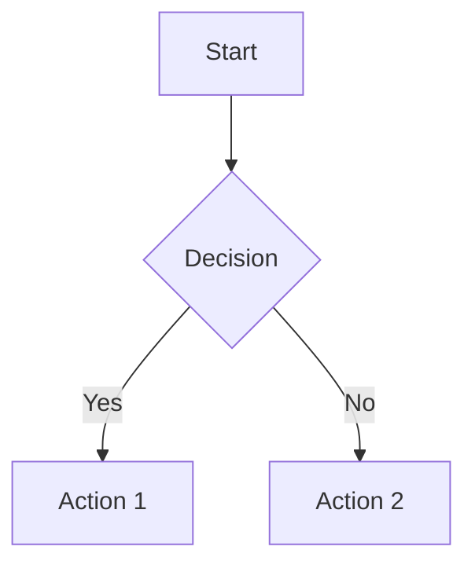

# Markdown Prompt Engineer - Third Edition

Expert-level markdown generation with AI-assisted workflows, automation, and production-grade documentation systems.

## Overview

This third edition represents the pinnacle of markdown prompt engineering, incorporating advanced AI techniques, automated workflows, quality assurance, and enterprise-grade documentation patterns. Designed for large-scale documentation projects, open-source ecosystems, and technical writing teams.

## Template Structure

### Enterprise-Grade Documentation System Generator

**Technique Tags:** Role + Schema-First + Chain-of-Thought + Self-Consistency + RAG-ready + Tree-of-Thought + Evaluation Rubric + Orchestration

```
Act as a principal technical writer and documentation architect with 10+ years of experience building enterprise documentation systems.

Mission: Design and generate a production-ready markdown documentation system for {project_name} that serves {primary_audience}, {secondary_audience}, and {tertiary_audience}.

## Phase 1: Discovery and Planning

First, analyze the documentation requirements:

1. Content Inventory:
   - What content types are needed? (tutorials, references, guides, API docs, etc.)
   - What is the information architecture?
   - What are the user journeys?
   - What content already exists (if any)?

2. Audience Analysis:
   {audience_details}

3. Technical Context:
   - Platform/technology stack: {tech_stack}
   - Deployment environment: {environment}
   - Update frequency: {update_frequency}
   - Localization needs: {localization}

4. Success Criteria:
   - Documentation completeness: {completeness_target}%
   - User satisfaction target: {satisfaction_target}/5
   - Search effectiveness: {search_target}%
   - Time-to-answer metric: < {response_time} minutes

## Phase 2: Architecture Design

Create a documentation system with these components:

### 2.1 Document Templates

Generate standardized templates for:

**Tutorial Template** - Step-by-step learning paths
```markdown
---
title: {Tutorial Title}
description: {One-line description}
difficulty: beginner|intermediate|advanced
duration: {estimated_minutes}
prerequisites:
  - {prerequisite_1}
  - {prerequisite_2}
tags: [{tag1}, {tag2}]
updated: {YYYY-MM-DD}
---

# {Tutorial Title}

## Overview
{What you'll learn and why it matters}

## Learning Objectives
By the end of this tutorial, you will:
- [ ] Objective 1
- [ ] Objective 2
- [ ] Objective 3

## Prerequisites
Before starting, ensure you have:
- ✓ {Prerequisite 1}
- ✓ {Prerequisite 2}

## Step-by-Step Guide

### Step 1: {Step Title}
{Clear explanation}

```{language}
{Working code example}
```

**Expected Output:**
```
{What should happen}
```

**Troubleshooting:**
- If you see {error}, try {solution}

✅ **Checkpoint:** You should now have {milestone}

### Step 2: {Next Step}
...

## Summary
{What was accomplished}

## Next Steps
- [Advanced Topic]({link})
- [Related Tutorial]({link})

## Feedback
Was this tutorial helpful? [Feedback form]({link})
```

**API Reference Template** - Complete API documentation
```markdown
---
title: {API Name} Reference
api_version: {version}
base_url: {base_url}
authentication: {auth_type}
rate_limits: {limits}
---

# {API Name} API Reference

## Authentication
{Authentication explanation with examples}

## Endpoints

### {HTTP_METHOD} {/endpoint/path}

**Description:** {What this endpoint does}

**Authentication Required:** Yes/No

**Rate Limit:** {limit} requests per {timeframe}

**Parameters:**

| Name | Type | Required | Description | Default | Example |
|------|------|----------|-------------|---------|---------|
| {param} | {type} | Yes/No | {description} | {default} | {example} |

**Request Example:**

```bash
curl -X {METHOD} "{base_url}{endpoint}" \
  -H "Authorization: Bearer {token}" \
  -H "Content-Type: application/json" \
  -d '{
    "{field}": "{value}"
  }'
```

**Response:**

**Success Response (200):**
```json
{
  "status": "success",
  "data": {
    "{field}": "{value}"
  }
}
```

**Error Responses:**

| Status Code | Description | Resolution |
|-------------|-------------|------------|
| 400 | {Error description} | {How to fix} |
| 401 | {Error description} | {How to fix} |

**Try it out:** [API Explorer]({link})
```

**Troubleshooting Guide Template**
```markdown
---
title: Troubleshooting {Feature/Component}
category: troubleshooting
common_issues: [{issue1}, {issue2}]
updated: {YYYY-MM-DD}
---

# Troubleshooting {Feature/Component}

## Quick Diagnostics

Run these checks first:
```bash
{diagnostic_command_1}
{diagnostic_command_2}
```

## Common Issues

### Issue: {Error Message or Symptom}

**Severity:** High | Medium | Low  
**Frequency:** Common | Occasional | Rare  
**Affected Versions:** {versions}

**Symptoms:**
- {Observable symptom 1}
- {Observable symptom 2}

**Root Causes:**
1. **{Cause 1}** (80% of cases)
   - Explanation...
   - Solution: {steps}
   
2. **{Cause 2}** (15% of cases)
   - Explanation...
   - Solution: {steps}

**Prevention:**
- {Prevention measure 1}
- {Prevention measure 2}

**Related Issues:**
- [Issue #{number}]({link})
- [Similar problem]({link})

---

### Issue: {Next Issue}
...
```

### 2.2 Documentation Site Structure

```
docs/
├── README.md (landing page)
├── getting-started/
│   ├── installation.md
│   ├── quick-start.md
│   └── configuration.md
├── guides/
│   ├── tutorials/
│   │   ├── beginner/
│   │   ├── intermediate/
│   │   └── advanced/
│   ├── how-to/
│   └── best-practices/
├── reference/
│   ├── api/
│   ├── cli/
│   └── configuration/
├── architecture/
│   ├── overview.md
│   ├── components/
│   └── decisions/ (ADRs)
├── contributing/
│   ├── development.md
│   ├── documentation.md
│   └── style-guide.md
└── troubleshooting/
    ├── common-issues.md
    ├── error-messages.md
    └── faq.md
```

### 2.3 Cross-Document Features

Implement these throughout:

**Navigation System:**
```markdown
<!-- Breadcrumb -->
[Home](/) > [Guides](/guides) > [Tutorials](/guides/tutorials) > Current Page

<!-- Prev/Next Navigation -->
[← Previous: {Title}]({link}) | [Next: {Title} →]({link})

<!-- Related Content Sidebar -->
## Related Topics
- [Topic 1]({link})
- [Topic 2]({link})

## In This Section
- [Section 1](#section-1)
- [Section 2](#section-2)
```

**Search Optimization:**
```markdown
<!-- Meta tags for documentation search -->
---
keywords: [{keyword1}, {keyword2}, {keyword3}]
search_boost: 1.0-2.0 (based on importance)
aliases: [{alternative_name1}, {alternative_name2}]
---
```

**Version Indicators:**
```markdown
> **📌 Version:** This document applies to version {version}  
> **⚠️ Deprecated:** This feature is deprecated since v{version}. Use [{alternative}]({link}) instead.  
> **✨ New:** Available since v{version}
```

## Phase 3: Content Generation

For each document in the system:

1. **Generate base content** following the template
2. **Apply style guide** - {style_guide_url or inline rules}
3. **Add cross-references** - Link to related docs
4. **Include examples** - Code, screenshots, diagrams
5. **Add metadata** - Tags, version, last updated

## Phase 4: Quality Assurance

Perform multi-level validation:

### Level 1: Markdown Syntax
□ Valid markdown (no syntax errors)
□ Consistent formatting (headings, lists, code blocks)
□ Proper escaping of special characters
□ Valid HTML (if embedded)

### Level 2: Content Quality
□ Accurate and up-to-date information
□ Clear and concise writing
□ Complete examples (no placeholders)
□ Proper grammar and spelling
□ Consistent terminology
□ Appropriate tone for audience

### Level 3: Structure and Navigation
□ Logical information hierarchy
□ Clear headings and subheadings
□ Working internal links
□ Valid external links
□ Proper table of contents
□ Effective cross-referencing

### Level 4: Accessibility
□ Descriptive link text (no "click here")
□ Alt text for images
□ Proper heading hierarchy
□ Color contrast in code examples
□ Screen reader friendly

### Level 5: Technical Accuracy
□ Code examples compile/run
□ Commands produce expected output
□ API responses match current version
□ Configuration examples are valid
□ Troubleshooting steps work

## Phase 5: Maintenance Plan

Include documentation for maintaining the documentation:

```markdown
# Documentation Maintenance Guide

## Update Schedule
- **Weekly:** Check for broken links, update stats
- **Monthly:** Review top search queries, update FAQs
- **Quarterly:** Content audit, remove outdated info
- **Per Release:** Update version-specific content

## Review Process
1. Technical review (accuracy)
2. Editorial review (clarity, style)
3. User testing (comprehension)
4. Final approval

## Metrics to Track
- Page views by document
- Search queries (successful and unsuccessful)
- User feedback scores
- Time on page
- Bounce rate
- Link clicks

## Documentation Debt
Track and prioritize:
- Outdated content
- Missing documentation
- Unclear sections
- Broken examples
- Requested topics

## Style Guide
[Link to comprehensive style guide]
```

## Output Requirements

Provide the following deliverables:

1. **Documentation Site Map** - Complete structure with all files
2. **Core Document Set** - 10-15 essential documents fully written
3. **Template Library** - Reusable templates for all doc types
4. **Style Guide** - Writing and formatting standards
5. **Contribution Guide** - How to add/update documentation
6. **Automation Scripts** - For validation, build, deploy (as markdown documentation)
7. **Metrics Dashboard** - How to measure documentation success

## Advanced Features

Include where applicable:

**Interactive Elements:**
```markdown
<!-- Tabbed content -->
<details>
<summary>Click to expand: Advanced Configuration</summary>

```yaml
advanced:
  setting: value
```
</details>

<!-- Mermaid diagrams -->


<!-- Embedded video -->
[](https://video-url)
```

**Documentation Testing:**
```markdown
<!-- Testable code blocks -->
```javascript test
// This code block will be tested automatically
const result = add(2, 2);
assert.equal(result, 4);
```

<!-- Link validation -->
<!-- @link-check-ignore --> for links to skip
```

**Multi-Language Support:**
```markdown
<!-- Language switcher -->
🌐 Languages: [English](./README.md) | [日本語](./README.ja.md) | [Español](./README.es.md)

<!-- Translatable content markers -->
<!-- i18n-extract: key="welcome-message" -->
Welcome to our documentation!
<!-- /i18n-extract -->
```

## AI-Assisted Workflows

Describe how to use AI throughout the documentation lifecycle:

**Content Generation:**
- Use prompt chaining for long documents
- Generate multiple variations, select best
- Auto-generate API docs from OpenAPI specs

**Review and Editing:**
- Consistency checking across documents
- Readability scoring
- Technical accuracy validation

**Maintenance:**
- Automated link checking
- Version update detection
- Staleness identification

Constraints:
{constraints}

Style Guide:
{style_guide}

Technology Stack:
{tech_stack}

Output Format:
Provide a complete, production-ready documentation system as markdown files with proper structure and navigation.
```

## Usage Example: Complete Documentation System

```
Act as a principal technical writer and documentation architect with 10+ years of experience building enterprise documentation systems.

Mission: Design and generate a production-ready markdown documentation system for "CloudStore SDK" that serves software developers, DevOps engineers, and technical managers.

## Phase 1: Discovery and Planning

1. Content Inventory:
   - SDK installation and setup guides
   - API reference documentation
   - Authentication and security guides
   - Integration tutorials
   - Performance optimization guides
   - Troubleshooting documentation

2. Audience Analysis:
   - Primary: Full-stack developers (Node.js, Python, Java)
   - Secondary: DevOps engineers deploying the SDK
   - Tertiary: Technical managers evaluating the SDK

3. Technical Context:
   - Platform/technology stack: Multi-language SDK (JavaScript, Python, Java)
   - Deployment environment: Cloud and on-premise
   - Update frequency: Monthly releases
   - Localization needs: English, Japanese, Spanish

4. Success Criteria:
   - Documentation completeness: 95%
   - User satisfaction target: 4.5/5
   - Search effectiveness: 90%
   - Time-to-answer metric: < 5 minutes

[Continue with all phases...]

Constraints:
- Total documentation set should be comprehensive but scannable
- Include working code examples in all three languages
- Generate diagrams for architecture and workflows
- Include security best practices throughout
- Make it SEO-friendly for developer search
- Ensure mobile-responsive formatting

Style Guide:
- Use American English
- Active voice preferred
- Code in monospace
- Consistent terminology (always "CloudStore SDK", never "the SDK")
- Include pronunciation guide for technical terms
- Use sentence case for headings

Technology Stack:
- Primary languages: JavaScript, Python, Java
- Documentation generator: Docsify or VuePress
- Diagram tool: Mermaid
- API spec: OpenAPI 3.0

Output Format:
Provide a complete, production-ready documentation system as markdown files with proper structure and navigation.
```

## Advanced Prompt Chaining

For very large documentation projects, chain multiple prompts:

### Chain 1: Planning
```
Generate a comprehensive documentation plan for {project}...
Output: Documentation architecture and file list
```

### Chain 2: Template Creation
```
Using this documentation plan: {plan}
Create templates for each document type...
Output: Template library
```

### Chain 3: Content Generation
```
Using this template: {template}
Generate content for: {specific_document}
Context: {context from previous chains}
Output: Completed document
```

### Chain 4: Review and Refinement
```
Review this documentation: {generated_docs}
Against these criteria: {quality_rubric}
Output: Issues found and corrections
```

### Chain 5: Integration
```
Integrate all documents into cohesive system:
{document_list}
Add navigation, cross-references, search metadata
Output: Final integrated documentation
```

## Quality Evaluation Rubric

Use this comprehensive rubric to evaluate documentation systems (1-5 scale):

| Category | Criteria | Weight | 1 (Poor) | 5 (Excellent) |
|----------|----------|--------|----------|---------------|
| **Completeness** | Coverage of topics | 20% | Major gaps | Comprehensive |
| **Accuracy** | Technical correctness | 20% | Multiple errors | Fully accurate |
| **Clarity** | Ease of understanding | 15% | Confusing | Crystal clear |
| **Structure** | Organization & navigation | 15% | Chaotic | Intuitive |
| **Examples** | Quality of examples | 10% | Missing/broken | Excellent |
| **Accessibility** | Inclusive design | 10% | Not accessible | Fully accessible |
| **Maintenance** | Updateability | 5% | Hard to maintain | Easy to update |
| **Search** | Findability | 5% | Poor search | Excellent search |

**Total Score:** ___/100

**Pass Threshold:** 80/100 for production use

## Automation and Tooling

Document automation opportunities:

```markdown
# Documentation Automation Guide

## Automated Generation
- **API docs from code:** Use JSDoc, Sphinx, Javadoc
- **Changelog from commits:** conventional-changelog
- **Screenshots:** Automated browser testing
- **Diagrams:** Code → Mermaid auto-generation

## Automated Validation
```bash
# Markdown linting
markdownlint **/*.md

# Link checking
markdown-link-check **/*.md

# Spell checking
cspell **/*.md

# Documentation testing
doctest **/*.md
```

## CI/CD Integration
```yaml
# .github/workflows/docs.yml
name: Documentation CI
on: [push, pull_request]
jobs:
  validate:
    runs-on: ubuntu-latest
    steps:
      - uses: actions/checkout@v3
      - name: Lint markdown
        run: markdownlint **/*.md
      - name: Check links
        run: markdown-link-check **/*.md
      - name: Test code examples
        run: npm run test-docs
  deploy:
    runs-on: ubuntu-latest
    if: github.ref == 'refs/heads/main'
    steps:
      - name: Build docs
        run: npm run build-docs
      - name: Deploy to GitHub Pages
        uses: peaceiris/actions-gh-pages@v3
```
```

## Best Practices Checklist

When generating enterprise documentation:

- [ ] **User-Centered:** Start with user journeys and tasks
- [ ] **Progressive Disclosure:** Layer complexity appropriately
- [ ] **Scannable:** Use headings, bullets, tables effectively
- [ ] **Searchable:** Optimize for documentation search
- [ ] **Accessible:** WCAG 2.1 AA compliant
- [ ] **Maintainable:** Clear ownership and update process
- [ ] **Testable:** Examples are verifiable
- [ ] **Versioned:** Clear version compatibility
- [ ] **Measurable:** Track usage and effectiveness
- [ ] **Multilingual:** I18n-ready structure

## Advanced Techniques

### 1. Documentation-as-Code

```markdown
<!-- Test this documentation -->
```yaml test
# Configuration that will be validated
database:
  host: localhost
  port: 5432
```

### 2. Living Documentation

```markdown
<!-- Auto-updated from API -->
<!-- @api-sync endpoint="/api/stats" field="response_time" -->
Average response time: 45ms
<!-- /api-sync -->
```

### 3. Interactive Tutorials

```markdown
## Interactive Setup

Try it now:
[](gitpod-link)

Or follow locally:
1. Clone: `git clone {repo}`
2. Install: `npm install`
3. Run: `npm start`
```

## Related Resources

- [First Edition](markdown_prompt_engineer_first.md) - Basic markdown generation
- [Second Edition](markdown_prompt_engineer_second.md) - Advanced techniques
- Main Portfolio Prompt #22: README scaffolding
- Main Portfolio Prompt #66: Prompt chaining design
- Main Portfolio Prompt #67: RAG instruction
- Main Portfolio Prompt #87: Synthetic dataset generator

## Conclusion

This third edition represents enterprise-grade documentation engineering. Use it for:

- Large open-source projects
- Commercial SDK documentation  
- Internal engineering wikis
- Technical knowledge bases
- Documentation-as-a-product initiatives

The key is systematic planning, consistent execution, rigorous quality control, and continuous improvement based on user feedback and metrics.

---

**Version:** 3.0  
**Last Updated:** 2025-10-16  
**Compatibility:** GPT-4, Claude 3 Opus, and similar advanced LLMs with large context windows  
**Recommended Context Window:** 32k+ tokens for full system generation
